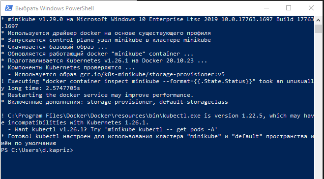

# Kubernetes установка под Windows:
1. Установить Docker (По умолчанию Minikube будет развертываться в контейнере Docker)
2. Скачиваем kubectl (инструмент командной строки для управления кластерами Kubernetes) по ссылке: https://dl.k8s.io/release/v1.26.0/bin/windows/amd64/kubectl.exe
3. Скачиваем minikube – файл с именем minikube-windows-amd64.exe из репозитория по ссылке: https://github.com/kubernetes/minikube/releases и переименовываем его в minikube.exe
4. Файлы kubectl.exe и minikube.exe складываем в отдельную папку и указываем путь переменной среды. Для этого нажимаем Этот компьютер (правая кнопка мыши) -> Свойства -> Дополнительные параметры системы -> Вкладка дополнительно -> Переменные среды. В переменную Path добавляем путь к нашей папке.
5. Проверяем работу команд в командной строке:
`minikube version`
`kubectl version`
6. Запускаем кластер командой: `minikube start`
Кластер автоматически развернется и запустится в контейнере docker.

После успешной установки в терминале должно быть следующее:

# Развертывание Docker контейнера в кластере Minikube для ТЕСТИРОВАНИЯ
1.	Выложить docker контейнер на docker hub.
2.	Написать манифест файл формата yaml для развертывания pod. За основу взять файл `kuber-pod.yaml`
и изменить image (ссылка на контейнер на docker hub с указанием версии).
3.	Выполнить команду из директории с манифест (yaml) файлом:

        `kubectl apply -f kuber-pod.yaml`, где kuber-pod.yaml - имя yaml файла

4.	Дождаться создания pod и проверить что pod создан. Следующая команда выводит список pod и их статус. Статус 
должен быть: Running

        `Kubectl get pods`

5.	Пробросить порт к контейнеру

        `kubectl port-forward kuber-test-pod 8000:8080`, где kuber-test-pod - имя yaml файла

6.	Проверить в браузере работу контейнера. Текущий контейнер будет доступен по http://localhost:8000/
7.	Удалить pod

        `kubectl delete -f kuber-pod.yaml`

8.	Проверить, что pod удален. Для этого запросить список pod

        `kubectl get pods`

# Расположение файлов конфигурации MINIKUBE
* C:\Users\user\.kube\config
* C:\Users\ user \.minikube

# Полезные команды общего типа

| Команда                                            | Описание                                         |
|:---------------------------------------------------|:-------------------------------------------------|
| minikube stop                                      | Остановка кластера (контейнера)                  |
| minikube start                                     | Создать и запустить кластер                      |
| minikube start -p MYCLUSTER                        | создать и запустить кластер с собственным именем |
| minikube start –cpus=2 –memory=4gb –disc-size=10gb | Параметры виртуальной машины, если запуск с VM   |
| minikube delete                                    | Удалить кластер                                  |
| minikube ssh                                       | подключиться к кластеру по ssh                   |
| kubectl get componentstatuses                      | Проверка кластера                                |
| kubectl cluster-info                               | Проверка кластера                                |
| kubectl get nodes                                  | Получить список nodes                            |
| kubectl describe node minikube                     | Получить список nodes                            |

# Команды для управления POD

| Команда                                                                       | Описание                                                       |
|:------------------------------------------------------------------------------|:---------------------------------------------------------------|
| kubectl run NAME_DEP --image=IMAGE_NAME:TAG --port=8000                       | Создать pod и deployment                                       |
| kubectl run NAME_POD –generator=run-pod/v1 --image=IMAGE_NAME:TAG --port=8000 | Создать только pod                                             |
| kubectl get pods                                                              | список pod                                                     |
| kubectl describe pod NAME_POD                                                 | статус pod                                                     |
| kubectl describe pods NAME_POD                                                | статус pod                                                     |
| kubectl exec -it NAME_POD -- /bin/bash                                        | зайти внутрь pod, -it интерактивно                             |
| kubectl apply -f file.yaml                                                    | запуск конфигурации yaml                                       |
| kubectl port-forward NAME_POD 11111:8000                                      | Проброс портов к POD                                           |
| kubectl logs NAME_POD                                                         | логи контейнера                                                |
| kubectl get po                                                                | вывести список pod                                             |
| kubectl get po --show-labels                                                  | вывести список pod с метками                                   |
| kubectl get po -L label1,label2,label3                                        | вывести список под с определенными метками                     |
| Kubectl create namespace NAME                                                 | Создать пространство имен                                      |
| Kubectl get ns                                                                | Получить пространство имен                                     |
| Kubectl get po --all-namespaces                                               | Получить список pod с пространством имен                       |
| Kubectl delete po POD_NAME                                                    | Удалить POD                                                    |
| kubectl delete -f file.yaml                                                   | Удалить все что прописано в файле, по которому все создавалось |
| Kubectl delete po -l run=label                                                | Удаление POD на основе селектора меток                         |
| Kubectl delete po ns testname                                                 | Удаление POD по пространству имен                              |

# Команды для управления DEPLOYMENT

| Команда                                                                                                                  | Описание                                                                                                             |
|:-------------------------------------------------------------------------------------------------------------------------|:---------------------------------------------------------------------------------------------------------------------|
| Kubectl get deployments                                                                                                  | список deloyments                                                                                                    |
| Kubectl get deploy                                                                                                       | список deloyments                                                                                                    |
| Kubectl create deployment NAME_DEPLOY --image IMAGE                                                                      | создать                                                                                                              |
| Kubectl describe deployments NAME_DEPLOY                                                                                 | Информация о deployments                                                                                             |
| Kubectl scale deployment NAME_DEPLOY --replicas 4                                                                        | Scalling deployments                                                                                                 |
| Kubectl get rs                                                                                                           | Вывести список scalling                                                                                              |
| Kubectl autoscale deployment NAME_DEPLOY --min=4 --max=6 --cpu-percent=80                                                | Auto scalling. Команда создаст объект horizontal pod autoscaler                                                      |
| Kubectl get hpa                                                                                                          | Вывести horizontal pod autoscaler                                                                                    |
| Kubectl rollout history deployment/deployment-name                                                                       | История всех deployment                                                                                              |
| Kubectl rollout status deployment/deployment-name                                                                        | Статус всех deployment                                                                                               |
| Kubectl set image deployment/deploy-name name-container-in-pods=image-docker-obraz:version --record                      | Изменение контейнера внутри POD в Deplouments                                                                        |
| Kubectl rollout undo deployment/deploy-name                                                                              | Вернуться на предыдущую версию                                                                                       |
| Kubectl rollout history deployment/deploy-name + Kubectl rollout undo deployment/deploy-name --to-revision=nomer-revisii | Вернуться на версию по номеру. Первой командой выводим историю версий. Далее откатываемся на номер версии из истории |
| Kubectl rollout restart deployment/name-deployment                                                                       | Берем новую версию и делаем с ней передеплой                                                                         |

# Команды для управления SERVICE

| Команда                                                              | Описание                    |
|:---------------------------------------------------------------------|:----------------------------|
| Kubectl expose deployment service-name --type=ClusterIP --port 80    | Создать сервис ClusterIP    |
| Kubectl expose deployment service-name --type=NodePort --port 80     | Создать сервис NodePort     |
| Kubectl expose deployment service-name --type=LoadBalancer --port 80 | Создать сервис LoadBalancer |
| Kubectl get services                                                 | Посмотреть список сервисов  |
| Kubectl get svc                                                      | Посмотреть список сервисов  |
| Kubectl delete service service-name                                  | Удалить сервис              |

# Команды для вывода DASHBOARD

| Команда            | Описание                                       |
|:-------------------|:-----------------------------------------------|
| minikube dashboard | Устанавливает и открывает в браузере dashboard |

# Полезные ссылки

* https://kubernetes.io/ru/docs/home/
* https://habr.com/ru/company/ruvds/blog/438984/
* https://www.youtube.com/@ADV-IT
* https://www.youtube.com/@BAKAVETS

# Схема вывода сервиса в браузере, если в minikube в docker

Если вы используете minikube с драйвером Docker, необходимо выполнить переадресацию портов. Откройте отдельный 
терминал командной строки и выполните следующую команду (оставив это окно открытым):

> kubectl port-forward service/hello-minikube 54080:8080

Теперь в исходном окне командной строки запустите службу:

> minikube service SERVICE_NAME

Теперь вы можете получить доступ к http://localhost:54080